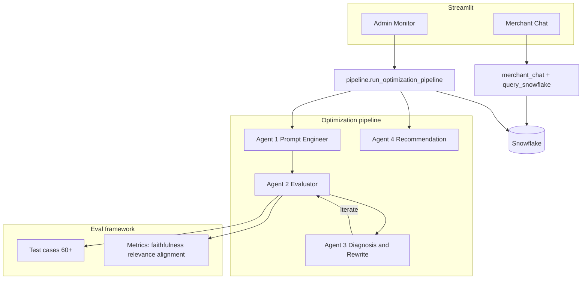

# Ledger AI

Production-grade Streamlit app combining a **merchant-facing payments chat assistant** (Snowflake-backed SQL tool use) with a **four-agent prompt optimization pipeline** (LangChain + Groq + multi-signal evaluation).

## Architecture



## Setup

1. **Python 3.11+** recommended (3.12 tested).

2. Create a virtual environment and install dependencies:

   ```bash
   cd /path/to/this/repo
   python3 -m venv .venv
   source .venv/bin/activate
   pip install -r ledger_ai/requirements.txt
   ```

3. **Environment variables** — copy `ledger_ai/.env.example` to `ledger_ai/.env` (or `.env` in the repo root) and fill in:

   - `GROQ_API_KEY`
   - `SNOWFLAKE_USER`, `SNOWFLAKE_PASSWORD`, `SNOWFLAKE_ACCOUNT`, `SNOWFLAKE_DATABASE`, `SNOWFLAKE_SCHEMA`, `SNOWFLAKE_WAREHOUSE`

4. **Synthetic data** (~5,000 rows):

   ```bash
   python ledger_ai/data/generate_synthetic_data.py
   ```

   Outputs `ledger_ai/data/transactions.csv` and `merchant_catalog.json`.

5. **Snowflake schema** — run `ledger_ai/db/schema.sql` in your worksheet, then load transactions (warehouse must be running), for example using Snowflake’s load UI or:

   ```python
   from ledger_ai.db.snowflake_client import load_transactions_csv
   load_transactions_csv("ledger_ai/data/transactions.csv")
   ```

   If Snowflake is not configured, the chat tool falls back to an **in-memory SQLite** copy of `transactions.csv` for local demos.

6. **Run the app**:

   ```bash
   streamlit run ledger_ai/app.py
   ```

   **Terminal noise (`ModuleNotFoundError: No module named 'torchvision'`)** comes from Streamlit’s file watcher probing `transformers`. The repo sets `[server] fileWatcherType = "none"` in `.streamlit/config.toml` so logs stay clean (restart Streamlit after edits). To re-enable auto-reload instead, install a matching `torch` + `torchvision` stack or switch that setting to `auto` and ignore the harmless warnings.

7. **Optimization pipeline (CLI)** — use `--mock` for fast, offline-friendly scoring (lexical relevance + deterministic faithfulness mock; no Groq judge pressure):

   ```bash
   python -m ledger_ai.agents.pipeline --mock --max-iterations 3
   ```

   Full Groq-backed runs are rate-limit heavy (see implementation notes in `ledger_ai_cursor_prompt.md`).

### Full (non-mock) run checklist

1. Put **`GROQ_API_KEY`** in `ledger_ai/.env` or repo-root `.env` (see `ledger_ai/.env.example`).
2. In the app sidebar, turn **Mock LLM** **off**.
3. First time, Hugging Face may download **`all-MiniLM-L6-v2`** for relevance scoring (needs network once).
4. Optional: limit eval breadth while you validate keys and rate limits:

   ```bash
   export LEDGER_EVAL_MAX_CASES=12
   streamlit run ledger_ai/app.py
   ```

   Omit that variable to evaluate all **60** cases per variant (very slow on Groq free tier).

5. **Copy / “Clear cache”:** Streamlit clears cache when the main canvas has focus and you press **`c`** alone. If shortcuts clash (e.g. embedded browser in an IDE), open the app in a normal browser and click inside the **chat input** before selecting text to copy. See the in-app sidebar **Tips: copy / shortcuts**.

6. Run optimization from **Admin Monitor → Run New Optimization**.

## Design Decisions (eval metrics)

- **Faithfulness (LLM-as-judge, Groq):** Directly targets unsupported claims against the provided reference excerpt — the failure mode we care about most in finance copilots (hallucinated numbers or entities). Chosen over token overlap alone because overlap can look “faithful” while mis-stating amounts.

- **Relevance (cosine similarity, `all-MiniLM-L6-v2`):** Measures whether the answer stays on the user’s question axis. Embeddings capture paraphrase better than lexical Jaccard for long stakeholder phrasing.

- **Business alignment (rubric 0–2 → 0–1):** Lightweight, transparent signal that nudges outputs toward **quantified** insight and **actionable** language without a second LLM call — keeps latency and cost predictable at scale.

- **Composite (0.4 / 0.3 / 0.3):** Weights faithfulness highest because incorrect figures are costlier than stylistic misalignment; relevance and alignment share the remainder so vague or non-actionable answers still regress the score.

- **Pass rule:** Composite ≥ 0.75 **and** no single metric &lt; 0.60 prevents “average good” models that still fail safety on one axis.

## Portfolio artifacts

- Capture **screenshots** of Merchant Chat and Admin Monitor after a successful optimization run.
- See **`PROMPT_ENGINEERING_LOG.md`** for documented optimization iterations and score movement.

## Repository layout

Key paths live under `ledger_ai/` as described in the build specification (`app.py`, `agents/`, `chat/`, `data/`, `db/`, `eval/`, `utils/`, `views/`).
