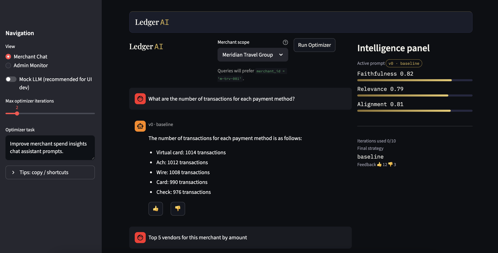
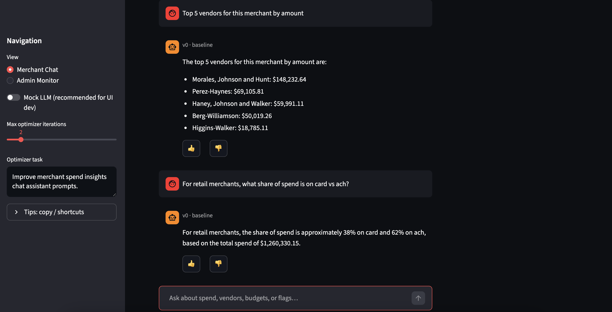
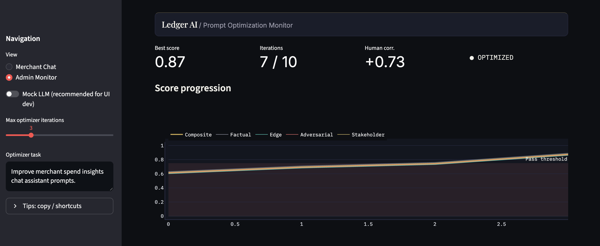

# Ledger AI

Ledger AI is a Streamlit app where merchants ask natural language questions about synthetic payment data through a Groq powered chat agent that runs SQL against Snowflake or a local SQLite copy of the CSV, and an admin view runs a four agent LangChain pipeline that generates prompt variants, scores them with an eval suite, rewrites prompts on failure, and writes a short recommendation. Configure `GROQ_API_KEY` and optional Snowflake env vars using `ledger_ai/.env.example`, generate data with `python ledger_ai/data/generate_synthetic_data.py`, then run `streamlit run ledger_ai/app.py`.

## Demo screenshots

Files live in `demo/`.

Merchant Chat with **Mock LLM** on: merchant scope (Meridian Travel Group), question about transaction counts per payment method, baseline prompt version, and the intelligence panel scores.

Same view with **Mock LLM** off: top vendors by amount for the selected merchant and a follow up on card versus ACH share for retail.

Admin Monitor: best score, iterations, human correlation, optimized status, and the score progression chart over iterations with the pass threshold.
